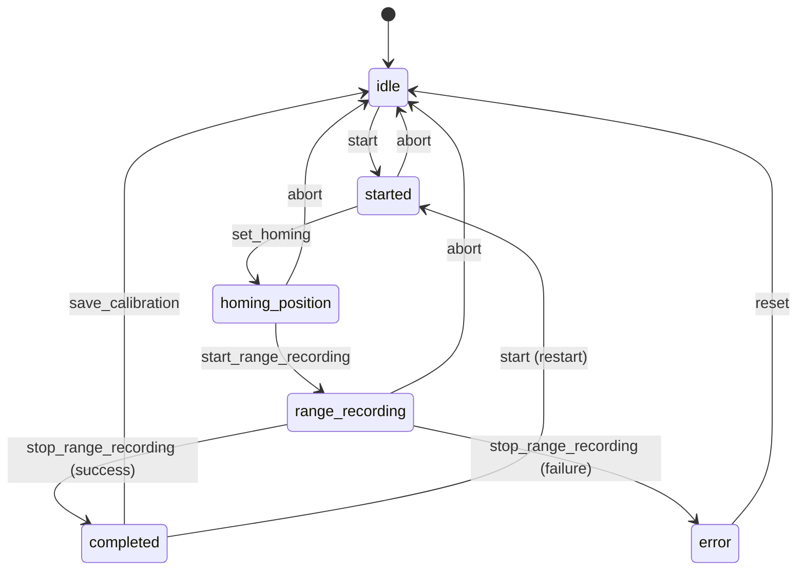

# SO-101 Calibration Sensor API Reference

## Overview

The SO-101 calibration sensor provides two distinct workflows:
1. **Motor Setup**: Configure servo IDs and communication parameters
2. **Calibration**: Record joint limits and save calibration data

The sensor implements a state machine for calibration workflow and provides real-time progress via sensor readings.

## Sensor Client Integration

### Viam SDK Usage
```typescript
import { SensorClient } from '@viamrobotics/sdk';
import { createResourceClient, createResourceQuery, createResourceMutation } from '@viamrobotics/svelte-sdk';

// Create sensor client
const sensorClient = createResourceClient(
  SensorClient,
  () => 'robot-part-id',
  () => 'so101-calibration'  // Component name in robot config
);

// Create reactive query for readings (1 second interval recommended)
const sensorReadings = createResourceQuery(
  sensorClient,
  'getReadings', 
  { refetchInterval: 1000 }
);

// Create mutation for sending commands
const doCommand = createResourceMutation(sensorClient, 'doCommand');

// Send command
const result = await doCommand.current.mutateAsync({
  command: 'start',
  // ... other parameters
});
```

## Sensor Readings API

### getReadings() Response Structure

```typescript
interface CalibrationReadings {
  // Core calibration state
  calibration_state: 'idle' | 'started' | 'homing_position' | 'range_recording' | 'completed' | 'error';
  instruction: string;                    // Human-readable instruction
  available_commands: string[];           // Valid commands for current state
  servo_count: number;                   // Number of servos being calibrated
  
  // Range recording progress (only during recording)
  recording_time_seconds?: number;       // Time elapsed since recording started
  position_samples?: number;             // Number of position samples collected
  
  // Individual joint data
  joints: Record<string, {
    id: number;                         // Servo ID (1-6)
    current_position: number;           // Current raw servo position
    homing_offset: number;              // Calculated homing offset
    recorded_min: number;               // Minimum recorded position  
    recorded_max: number;               // Maximum recorded position
    is_completed: boolean;              // Has sufficient range data
  }>;
  
  // Motor setup status (separate from calibration)
  motor_setup: {
    in_progress: boolean;               // Is motor setup operation active
    step: number;                       // Current setup step
    status: string;                     // Status message
  };
  
  // Error information (only when calibration_state === 'error')
  error?: string;                       // Error description
}
```

### Example Readings by State

#### Idle State
```json
{
  "calibration_state": "idle",
  "instruction": "Ready to start calibration. Use DoCommand with 'start' to begin.",
  "available_commands": ["start"],
  "servo_count": 5,
  "joints": {},
  "motor_setup": {
    "in_progress": false,
    "step": 0,
    "status": "Motor setup ready"
  }
}
```

#### Range Recording State  
```json
{
  "calibration_state": "range_recording",
  "instruction": "Recording range of motion. Move all joints through their full ranges.",
  "available_commands": ["stop_range_recording", "abort"],
  "servo_count": 5,
  "recording_time_seconds": 15.3,
  "position_samples": 306,
  "joints": {
    "shoulder_pan": {
      "id": 1,
      "current_position": 2150,
      "homing_offset": -103,
      "recorded_min": 758,
      "recorded_max": 3292,
      "is_completed": false
    },
    "shoulder_lift": {
      "id": 2, 
      "current_position": 1875,
      "homing_offset": 157,
      "recorded_min": 612,
      "recorded_max": 3401,
      "is_completed": true
    }
  },
  "motor_setup": {
    "in_progress": false,
    "step": 0,
    "status": "Motor setup complete"
  }
}
```

#### Error State
```json
{
  "calibration_state": "error",
  "instruction": "Invalid ranges detected. Some joints may not have been moved through their full range.",
  "available_commands": ["reset", "start"],
  "servo_count": 5,
  "joints": {},
  "motor_setup": {
    "in_progress": false,
    "step": 0, 
    "status": "Motor setup ready"
  },
  "error": "Failed to write calibration data to servo registers"
}
```

## DoCommand API Reference

### Motor Setup Commands

#### `motor_setup_discover`
**Purpose**: Discover a single motor connected to the bus
**Usage**: Connect only one motor, then discover its current configuration

```json
{
  "command": "motor_setup_discover",
  "motor_name": "gripper"
}
```

**Parameters**:
- `motor_name` (string, required): Motor name from SO-101 configuration
  - Valid values: `"gripper"`, `"wrist_roll"`, `"wrist_flex"`, `"elbow_flex"`, `"shoulder_lift"`, `"shoulder_pan"`

**Success Response**:
```json
{
  "success": true,
  "motor_name": "gripper",
  "current_id": 1,
  "target_id": 6,
  "model": "sts3215", 
  "found_baudrate": 57600,
  "status": "Found gripper: ID 1, Model sts3215, Baudrate 57600"
}
```

**Error Conditions**:
- No motors found: `"no servos found"`
- Multiple motors: `"multiple servos found (2) - connect only one motor"`
- Model mismatch: `"model mismatch: expected sts3215, found sts3032"`
- Communication failure: `"discovery failed: serial communication error"`

---

#### `motor_setup_assign_id`
**Purpose**: Assign target ID and baudrate to discovered motor
**Usage**: Configure motor with proper ID for SO-101 operation

```json
{
  "command": "motor_setup_assign_id",
  "motor_name": "gripper",
  "current_id": 1,
  "target_id": 6,
  "current_baudrate": 57600
}
```

**Parameters**:
- `motor_name` (string, required): Motor name
- `current_id` (number, required): Motor's current servo ID  
- `target_id` (number, required): Desired servo ID (1-6)
- `current_baudrate` (number, required): Motor's current baudrate

**Success Response**:
```json
{
  "success": true,
  "motor_name": "gripper",
  "old_id": 1,
  "new_id": 6, 
  "new_baudrate": 1000000,
  "status": "Successfully configured gripper (ID: 6)"
}
```

**Error Conditions**:
- Invalid parameters: `"current_id parameter required"`
- Communication failure: `"failed to ping servo"`
- ID assignment failure: `"failed to set servo ID"`
- Baudrate change failure: `"failed to set baudrate"`

---

#### `motor_setup_verify`
**Purpose**: Verify all SO-101 motors are properly configured and responding
**Usage**: Connect all motors, then verify complete system

```json
{
  "command": "motor_setup_verify"
}
```

**Success Response**:
```json
{
  "success": true,
  "motors": {
    "shoulder_pan": { "id": 1, "status": "ok", "model": "sts3215" },
    "shoulder_lift": { "id": 2, "status": "ok", "model": "sts3215" },
    "elbow_flex": { "id": 3, "status": "ok", "model": "sts3215" },
    "wrist_flex": { "id": 4, "status": "ok", "model": "sts3215" },
    "wrist_roll": { "id": 5, "status": "ok", "model": "sts3215" },
    "gripper": { "id": 6, "status": "ok", "model": "sts3215" }
  },
  "status": "✅ All SO-101 motors verified successfully"
}
```

**Partial Failure Response**:
```json
{
  "success": false,
  "motors": {
    "shoulder_pan": { "id": 1, "status": "ok", "model": "sts3215" },
    "shoulder_lift": { "id": 2, "status": "not_responding", "error": "communication timeout" },
    "elbow_flex": { "id": 3, "status": "not_found", "error": "servo not in controller" }
  },
  "status": "⚠️ Some motors failed verification"
}
```

---

#### `motor_setup_scan_bus` (Debugging)
**Purpose**: Scan entire bus for connected servos
**Usage**: Diagnostic tool to see all connected servos

```json
{
  "command": "motor_setup_scan_bus"
}
```

**Response**:
```json
{
  "success": true,
  "servos_found": 3,
  "unexpected_count": 1,
  "servos": [
    { "id": 1, "model": "sts3215", "expected_name": "shoulder_pan", "status": "expected" },
    { "id": 2, "model": "sts3215", "expected_name": "shoulder_lift", "status": "expected" },
    { "id": 7, "model": "sts3215", "status": "unexpected" }
  ],
  "status": "Found 3 servos (1 unexpected)"
}
```

### Calibration Workflow Commands

#### `start`
**Purpose**: Begin calibration workflow
**Effect**: Disables servo torque for manual positioning

```json
{
  "command": "start"
}
```

**Success Response**:
```json
{
  "success": true,
  "state": "started",
  "message": "Calibration started. Manually move the robot to the middle of its range of motion, then use 'set_homing' command."
}
```

**Valid States**: `idle`, `completed`, `error`
**Next State**: `started`

---

#### `set_homing`
**Purpose**: Set homing offsets based on current arm position
**Usage**: Position arm manually to center, then call this command

```json
{
  "command": "set_homing"
}
```

**Success Response**:
```json
{
  "success": true,
  "state": "homing_position",
  "homing_offsets": {
    "1": -103,
    "2": 157,
    "3": -45,
    "4": 89,
    "5": -12
  },
  "message": "Homing positions set. Now use 'start_range_recording' command, then move all joints through their entire ranges of motion."
}
```

**Valid States**: `started`
**Next State**: `homing_position`

---

#### `start_range_recording`
**Purpose**: Begin recording joint range limits
**Effect**: Starts background position monitoring

```json
{
  "command": "start_range_recording"
}
```

**Success Response**:
```json
{
  "success": true,
  "state": "range_recording",
  "message": "Recording range of motion. Move all joints through their full ranges. Use 'stop_range_recording' when complete."
}
```

**Valid States**: `homing_position`
**Next State**: `range_recording`
**Note**: Background goroutine starts collecting position data at 100Hz

---

#### `stop_range_recording`
**Purpose**: Complete range recording and validate collected data
**Usage**: Call after moving all joints through complete ranges

```json
{
  "command": "stop_range_recording"
}
```

**Success Response**:
```json
{
  "success": true,
  "state": "completed",
  "recording_duration": 18.7,
  "samples_collected": 1870,
  "ranges": {
    "shoulder_pan": { "min": 758, "max": 3292, "range": 2534 },
    "shoulder_lift": { "min": 612, "max": 3401, "range": 2789 },
    "elbow_flex": { "min": 445, "max": 3650, "range": 3205 },
    "wrist_flex": { "min": 512, "max": 3583, "range": 3071 },
    "wrist_roll": { "min": 0, "max": 4095, "range": 4095 }
  },
  "message": "Range recording completed. Use 'save_calibration' to write calibration to servos and save to file."
}
```

**Error Response** (insufficient movement):
```json
{
  "success": false,
  "error": "Invalid ranges detected. Some joints may not have been moved through their full range.",
  "state": "error"
}
```

**Valid States**: `range_recording`
**Next State**: `completed` (success) or `error` (failure)

---

#### `save_calibration`
**Purpose**: Write calibration to servo registers and save file
**Effect**: Persists calibration permanently

```json
{
  "command": "save_calibration"
}
```

**Success Response**:
```json
{
  "success": true,
  "state": "idle",
  "calibration_file": "/path/to/so101_calibration.json",
  "joints_calibrated": 5,
  "message": "Calibration completed and saved successfully. Ready for new calibration."
}
```

**Valid States**: `completed`
**Next State**: `idle`

---

#### `abort`
**Purpose**: Cancel current calibration process
**Usage**: Emergency stop or restart calibration

```json
{
  "command": "abort"
}
```

**Response**:
```json
{
  "success": true,
  "state": "idle",
  "message": "Calibration aborted. Ready to start new calibration."
}
```

**Valid States**: Any state except `idle`
**Next State**: `idle`

---

#### `reset`
**Purpose**: Reset sensor to initial state from error condition
**Usage**: Clear error state and restart

```json
{
  "command": "reset"
}
```

**Response**:
```json
{
  "success": true,
  "state": "idle", 
  "message": "Calibration sensor reset. Ready to start calibration."
}
```

**Valid States**: `error`
**Next State**: `idle`

### Utility Commands

#### `get_current_positions`
**Purpose**: Read current servo positions for debugging
**Usage**: Check arm position during any workflow phase

```json
{
  "command": "get_current_positions"
}
```

**Response**:
```json
{
  "success": true,
  "positions": {
    "shoulder_pan": {
      "servo_id": 1,
      "raw_position": 2150,
      "radians": 1.047,
      "degrees": 60.0
    },
    "shoulder_lift": {
      "servo_id": 2,
      "raw_position": 1875,
      "radians": 0.785,
      "degrees": 45.0
    }
  }
}
```

## State Machine Reference

### Calibration States



### State Transition Rules

| From State | Valid Commands | Next State | Notes |
|------------|----------------|------------|-------|
| `idle` | `start` | `started` | Disables torque |
| `started` | `set_homing`, `abort` | `homing_position`, `idle` | Records current position as center |
| `homing_position` | `start_range_recording`, `abort` | `range_recording`, `idle` | Begins position monitoring |
| `range_recording` | `stop_range_recording`, `abort` | `completed`/`error`, `idle` | Validates recorded ranges |
| `completed` | `save_calibration`, `start` | `idle`, `started` | Writes to servos and file |
| `error` | `reset`, `start` | `idle`, `started` | Clears error state |

## Error Handling

### Common Error Types

#### Connection Errors
```json
{
  "success": false,
  "error": "Failed to communicate with servo 3: serial communication timeout"
}
```
**Recovery**: Check physical connections, retry command

#### State Validation Errors  
```json
{
  "success": false,
  "error": "calibration already in progress (state: range_recording)"
}
```
**Recovery**: Check current state via readings, use `abort` if needed

#### Hardware Errors
```json
{
  "success": false, 
  "error": "Failed to write homing offset to servo 2: register write failed"
}
```
**Recovery**: Check servo power and connections, use `reset` command

#### Range Validation Errors
```json
{
  "success": false,
  "error": "Invalid ranges detected. Some joints may not have been moved through their full range.",
  "state": "error"
}
```
**Recovery**: Use `reset`, restart calibration, ensure full joint movement

### Error Recovery Patterns

```typescript
// Recommended error handling pattern
const sendCommand = async (command: Record<string, any>) => {
  try {
    const result = await doCommand.current.mutateAsync(command);
    if (!result.success) {
      throw new Error(result.error || 'Command failed');
    }
    return result;
  } catch (error) {
    // Log technical details
    console.error('Command failed:', command, error);
    
    // Determine recovery strategy
    if (error.message.includes('communication')) {
      throw new Error('Communication failed. Check servo connections and try again.');
    } else if (error.message.includes('state:')) {
      throw new Error('Invalid operation for current state. Please follow the workflow steps.');
    } else {
      throw new Error(`Operation failed: ${error.message}`);
    }
  }
};
```

## Development Mock Data

### Mock Sensor Client for Testing

```typescript
// src/lib/mocks/mockSensor.ts
export class MockSO101Sensor {
  private state = 'idle';
  private joints = {};
  private recordingStartTime: number | null = null;
  private sampleCount = 0;

  async getReadings() {
    const baseReading = {
      calibration_state: this.state,
      servo_count: 5,
      joints: this.joints,
      motor_setup: {
        in_progress: false,
        step: 0,
        status: 'Motor setup ready'
      },
      available_commands: this.getAvailableCommands()
    };

    switch (this.state) {
      case 'idle':
        return {
          ...baseReading,
          instruction: 'Ready to start calibration. Use DoCommand with \'start\' to begin.'
        };
      
      case 'range_recording':
        const elapsed = this.recordingStartTime ? (Date.now() - this.recordingStartTime) / 1000 : 0;
        return {
          ...baseReading,
          instruction: 'Recording range of motion. Move all joints through their full ranges.',
          recording_time_seconds: elapsed,
          position_samples: this.sampleCount
        };
      
      default:
        return baseReading;
    }
  }

  async doCommand(cmd: any) {
    // Simulate command processing with delays
    await new Promise(resolve => setTimeout(resolve, 500));
    
    switch (cmd.command) {
      case 'motor_setup_discover':
        return {
          success: true,
          motor_name: cmd.motor_name,
          current_id: 1,
          target_id: this.getTargetId(cmd.motor_name),
          model: 'sts3215',
          found_baudrate: 57600
        };
      
      case 'start':
        this.state = 'started';
        return { success: true, state: 'started' };
      
      case 'start_range_recording':
        this.state = 'range_recording';
        this.recordingStartTime = Date.now();
        this.sampleCount = 0;
        this.startMockRecording();
        return { success: true, state: 'range_recording' };
      
      default:
        return { success: true };
    }
  }

  private getTargetId(motorName: string): number {
    const ids = {
      'gripper': 6, 'wrist_roll': 5, 'wrist_flex': 4,
      'elbow_flex': 3, 'shoulder_lift': 2, 'shoulder_pan': 1
    };
    return ids[motorName] || 1;
  }

  private startMockRecording() {
    const interval = setInterval(() => {
      if (this.state !== 'range_recording') {
        clearInterval(interval);
        return;
      }
      this.sampleCount += Math.floor(Math.random() * 5) + 1;
    }, 100);
  }
}
```

## Calibration File Format

### Output File Structure
The sensor saves calibration data in JSON format:

```json
{
  "shoulder_pan": {
    "id": 1,
    "drive_mode": 0,
    "homing_offset": -1470,
    "range_min": 758,
    "range_max": 3292,
    "norm_mode": 3
  },
  "shoulder_lift": {
    "id": 2,
    "drive_mode": 0,
    "homing_offset": 157, 
    "range_min": 612,
    "range_max": 3401,
    "norm_mode": 3
  },
  "elbow_flex": {
    "id": 3,
    "drive_mode": 0,
    "homing_offset": -45,
    "range_min": 445,
    "range_max": 3650,
    "norm_mode": 3
  },
  "wrist_flex": {
    "id": 4,
    "drive_mode": 0,
    "homing_offset": 89,
    "range_min": 512,
    "range_max": 3583,
    "norm_mode": 3
  },
  "wrist_roll": {
    "id": 5,
    "drive_mode": 0,
    "homing_offset": -12,
    "range_min": 0,
    "range_max": 4095,
    "norm_mode": 3
  },
  "gripper": {
    "id": 6,
    "drive_mode": 0,
    "homing_offset": 1407,
    "range_min": 2031,
    "range_max": 3476,
    "norm_mode": 1
  }
}
```

**Field Meanings**:
- `id`: Servo ID (1-6)
- `drive_mode`: 0 = normal direction
- `homing_offset`: Offset to center joint range at zero position
- `range_min`/`range_max`: Physical joint limits in servo positions
- `norm_mode`: 3 = degrees, 1 = percentage (gripper uses percentage)

## Performance Considerations

### Sensor Reading Intervals
- **Recommended**: 1000ms for normal operation
- **During Recording**: Can increase to 500ms for better progress feedback
- **Avoid**: <100ms intervals to prevent overwhelming the robot

### Command Timing
- **Discovery**: ~500ms typical response time
- **ID Assignment**: ~1-2 seconds (writes to servo EEPROM)
- **Range Recording**: User-dependent (typically 10-30 seconds)
- **Save Calibration**: ~2-3 seconds (writes multiple servo registers)

### Memory Management
- Position history limited to 1000 samples to prevent memory issues
- Clear sensor reading subscriptions on component unmount
- Abort background recording goroutines on navigation away

## Troubleshooting Guide

### Common Issues and Solutions

#### "no servos found"
**Cause**: No motors connected or communication failure
**Solution**: 
1. Check USB cable connection
2. Verify correct serial port in robot config
3. Check servo power supply
4. Ensure no other applications using serial port

#### "multiple servos found"
**Cause**: Multiple motors connected during discovery
**Solution**: Disconnect all motors except the one being configured

#### "Invalid ranges detected"  
**Cause**: Joints not moved through sufficient range during recording
**Solution**: 
1. Use `reset` command to clear error
2. Restart calibration process
3. Move each joint to its mechanical limits during recording
4. Ensure smooth, slow movements for good data collection

#### "Failed to write calibration data"
**Cause**: Servo register write failure
**Solution**:
1. Check servo power and connections
2. Verify servo IDs are correct
3. Use `reset` and retry calibration
4. Check for servo firmware issues

### Diagnostic Commands

```typescript
// Check controller status
{ "command": "controller_status" }

// Verify servo configuration  
{ "command": "verify_config" }

// Test servo communication
{ "command": "test_servo_communication" }

// Reinitialize with retries
{ "command": "reinitialize", "retries": 3 }
```

## Implementation Notes for Claude Code

### Critical Implementation Points

1. **Connection Parsing**: Must handle missing/malformed cookies gracefully
2. **State Synchronization**: UI must stay in sync with sensor state machine
3. **Real-time Updates**: Use reactive queries with appropriate intervals
4. **Error Recovery**: Provide clear recovery paths for each error type
5. **Safety Features**: Prominent abort/emergency stop functionality

### Viam SDK Integration Patterns

```typescript
// Reactive sensor readings with error handling
const sensorReadings = createResourceQuery(
  sensorClient,
  'getReadings',
  { 
    refetchInterval: 1000,
    retry: false  // Handle retries manually for better UX
  }
);

// Command with proper error handling
const sendCommand = async (cmd: any) => {
  try {
    const result = await doCommand.current.mutateAsync(cmd);
    if (!result.success) {
      throw new Error(result.error || 'Command failed');
    }
    return result;
  } catch (error) {
    // Transform technical errors into user-friendly messages
    throw new Error(getUserFriendlyError(error));
  }
};
```

### UI/UX Guidelines

1. **Progress Visibility**: Always show current step and overall progress
2. **Loading States**: Show spinners during command execution  
3. **Error Display**: Red-bordered alerts with specific recovery instructions
4. **Success Feedback**: Green confirmations with next step guidance
5. **Safety Warnings**: Prominent amber alerts for safety considerations

### Testing Strategy

1. **Mock Development**: Use mock sensor for UI development
2. **Error Simulation**: Test all error conditions and recovery paths
3. **State Transitions**: Verify proper handling of all state machine transitions
4. **Edge Cases**: Test with malformed responses and network failures
5. **User Flow**: Complete end-to-end workflow testing

This API reference provides complete implementation guidance for integrating with the SO-101 calibration sensor through the Viam platform.